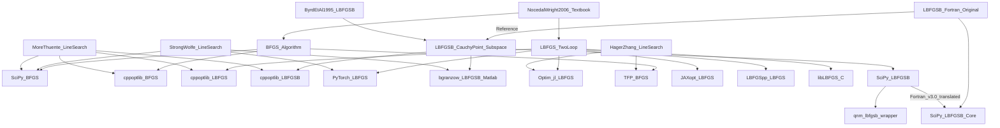

# 実装比較（BFGS / L-BFGS）

`qnm` の設計判断（特に **線形探索** と **安全策**）を固めるために、広く使われている代表的な実装を **BFGS/L-BFGS + L-BFGS-B** まで含めて比較します。

- 対象: `qnm.lbfgsb`（SciPyラッパー）, SciPy（BFGS / L-BFGS-B）, PyTorch（LBFGS）, libLBFGS（C）, LBFGSpp（C++）, Optim.jl（Julia）, JAXopt（JAX）, TensorFlow Probability（BFGS）, bgranzow/L-BFGS-B（別実装）, CppNumericalSolvers（BFGS / L-BFGS / L-BFGS-B）
- 注意: 実装によって「既定値」や「公開API」が異なるため、ここでは **既定挙動＋主要な設計ポイント**に焦点を当てます。

## 比較表（設計判断のための観点）

| 実装 | 主対象 | 線形探索 | 曲率チェック/ダンピング | 初期スケーリング | 停止条件（代表） |
|---|---|---|---|---|---|
| **`qnm.lbfgsb`**（本リポジトリ） 出典: `src/python/qnm/lbfgsb.py` | **境界制約** / 大規模（ラッパー） | SciPy `fmin_l_bfgs_b` に委譲 | SciPy（L-BFGS-B実装）に委譲 | SciPy（L-BFGS-B実装）に委譲 | `pgtol` 等は SciPy 側に委譲（`qnm` 側は結果整形＋カウンタ整合） |
| **SciPy BFGS**（Python） 出典: [scipy/scipy `scipy/optimize/_optimize.py`](https://github.com/scipy/scipy/blob/main/scipy/optimize/_optimize.py) | 無制約 / 中小規模（密行列） | `_line_search_wolfe12` による **Strong Wolfe**（`c1,c2`） | 主要には Wolfe で正定性を担保。`y^T s == 0` などに対する保険的分岐あり | `hess_inv0` を与えない場合は **単位行列** | 勾配ノルム `gtol`、`xrtol`（ステップが小さい）、`maxiter`、数値不安定（`nan`等） |
| **SciPy L-BFGS-B**（Python/C/Fortran由来） 出典: [scipy/scipy `scipy/optimize/_lbfgsb_py.py`](https://github.com/scipy/scipy/blob/main/scipy/optimize/_lbfgsb_py.py) | **境界制約** / 大規模 | `maxls`（line search step数上限）がAPIに露出（内部はL-BFGS-B実装に委譲） | **投影勾配**を用いた収束判定（`pgtol`）。内部は実装（L-BFGS-B v3.0）に依存 | L-BFGS-B実装に依存 | `pgtol`（投影勾配の最大成分）、`factr`/`ftol`（相対的減少）、`maxiter`/`maxfun` |
| **PyTorch LBFGS**（Python, DL向け） 出典: [pytorch/pytorch `torch/optim/lbfgs.py`](https://github.com/pytorch/pytorch/blob/master/torch/optim/lbfgs.py) | 無制約 / DL（closure前提） | `line_search_fn='strong_wolfe'` の場合、**Strong Wolfe**（cubic interpolate + zoom） | 曲率 `y^T s` が小さい場合は履歴更新しない（`ys > 1e-10` の条件） | `H_diag = (y^T s)/(y^T y)` による **スカラー初期化**（毎更新） | `tolerance_grad`（max-norm）、`tolerance_change`（更新量/損失差など）、`max_iter`、`max_eval` |
| **libLBFGS**（C） 出典: [chokkan/liblbfgs `lib/lbfgs.c`](https://github.com/chokkan/liblbfgs/blob/master/lib/lbfgs.c) | 無制約 / 大規模（低レベルAPI） | **More-Thuente** または **Backtracking**（Armijo/Wolfe/Strong Wolfe）を選択可能 | `linesearch` 種別で挙動を選べる。さらに **OWL-QN（L1）** 用の特別ケースあり | 実装に依存（内部でスケーリング等） | `epsilon`（勾配ノルム系）、`past`+`delta`（目的関数減少率）、`max_linesearch`、`max_step/min_step` |
| **LBFGSpp**（C++/Eigen） 出典: [yixuan/LBFGSpp `include/LBFGS.h`](https://github.com/yixuan/LBFGSpp/blob/master/include/LBFGS.h) | 無制約 / 大規模 | **LineSearch をテンプレで差し替え**（NocedalWright / MoreThuente / Backtracking など） | `s^T y` が弱い場合は補正を追加しない（`s·y > eps * ||y||^2`） | 既定は **Strong Wolfe** 系（`ftol=1e-4`, `wolfe=0.9`）で運用。初期ステップは実装側 | `epsilon`/`epsilon_rel`（勾配ノルム）、`past`+`delta`（目的関数）、`max_iterations`、`max_linesearch` |
| **Optim.jl LBFGS**（Julia） 出典: [JuliaNLSolvers/Optim.jl `l_bfgs.jl`](https://github.com/JuliaNLSolvers/Optim.jl/blob/master/src/multivariate/solvers/first_order/l_bfgs.jl) | 無制約 / 大規模 | 既定は **Hager-Zhang**（`LineSearches.HagerZhang()`）。差し替え可能 | two-loop 内の **式(7.20)** スケーリングをオプションで適用（`scaleinvH0`） | `scaleinvH0=true` で **Eq. 7.20** によるスケーリング | Optim の `Options`（反復上限、`g_abstol`/`x_abstol`/`f_reltol` など）で制御 |
| **JAXopt LBFGS**（JAX） 出典: [google/jaxopt `_src/lbfgs.py`](https://github.com/google/jaxopt/blob/main/jaxopt/_src/lbfgs.py) | 無制約 / 大規模（pytree） | `linesearch` を選択（`zoom` / `backtracking` / `hager-zhang`） | `rho = 1/(s^T y)` を計算し、`s^T y == 0` は `rho=0` にする等の防御（実装側） | `use_gamma` で **Eq. 7.20** の `gamma * I` を使用（`compute_gamma`） | `tol`（誤差）、`maxiter`、`stop_if_linesearch_fails` など |
| **TFP BFGS**（TensorFlow Probability） 出典: [tensorflow/probability `python/optimizer/bfgs.py`](https://github.com/tensorflow/probability/blob/main/tensorflow_probability/python/optimizer/bfgs.py) | 無制約 / バッチ対応 | **Hager-Zhang**（モジュール冒頭で明記） | 逆ヘッセ推定を保持し、`scale_initial_inverse_hessian` 等で安定化の余地 | `scale_initial_inverse_hessian`（初期逆ヘッセのスケーリング） | `tolerance`（勾配supノルム）、`x_tolerance`、`f_relative_tolerance`、`f_absolute_tolerance`、`max_iterations`、`max_line_search_iterations` |
| **bgranzow/L-BFGS-B**（Matlab） 出典: [bgranzow/L-BFGS-B `LBFGSB.m`](https://raw.githubusercontent.com/bgranzow/L-BFGS-B/master/LBFGSB.m) | **境界制約** / 大規模 | `strong_wolfe()`（**Strong Wolfe**。`c1=1e-4`,`c2=0.9`）を内蔵。`subspace_min()` が有効なときのみ line search 実行 | `curv = s^T y` を計算し、`curv < eps` なら **警告して更新スキップ**（負曲率検出） | `theta = (y^T y)/(y^T s)` を更新し、`W=[Y, theta*S]` を構成（L-BFGS-Bの内部表現） | `get_optimality()` による **投影勾配の∞ノルム**が `tol` 以下、または `max_iters` 到達 |
| **cppoptlib BFGS**（C++ / CppNumericalSolvers） 出典: [PatWie/CppNumericalSolvers `bfgs.h`](https://raw.githubusercontent.com/PatWie/CppNumericalSolvers/main/include/cppoptlib/solver/bfgs.h) | 無制約 / 中小規模（密行列） | **More-Thuente** line search（`more_thuente.h`） | `g^T p > 0` または `nan` で **H を単位行列にリセット**し、`p=-g` にフォールバック | 初期 `H=I` | **既定**: `max_iter=10000`、`x_delta=||Δx||_∞ < 1e-9` が **5回連続**、`f_delta=|Δf| < 1e-9` が **5回連続**、`||g||_∞ < 1e-6`（出典: [`progress.h`](https://raw.githubusercontent.com/PatWie/CppNumericalSolvers/main/include/cppoptlib/solver/progress.h)） |
| **cppoptlib L-BFGS**（C++ / CppNumericalSolvers） 出典: [PatWie/CppNumericalSolvers `lbfgs.h`](https://raw.githubusercontent.com/PatWie/CppNumericalSolvers/main/include/cppoptlib/solver/lbfgs.h) | 無制約 / 大規模 | **More-Thuente** line search（`more_thuente.h`） | 降下方向が無効なら `p=-g` にフォールバックし、**履歴をリセット**。さらに cautious update（`cautious_factor_`）で曲率が弱い更新を拒否 | `scaling_factor_` を適応更新（概ね \((s^T y)/(y^T y)\) 系） | **既定**: `max_iter=10000`、`x_delta=||Δx||_∞ < 1e-9` が **5回連続**、`f_delta=|Δf| < 1e-9` が **5回連続**、`||g||_∞ < 1e-6`（出典: [`progress.h`](https://raw.githubusercontent.com/PatWie/CppNumericalSolvers/main/include/cppoptlib/solver/progress.h)） |
| **cppoptlib L-BFGS-B**（C++ / CppNumericalSolvers） 出典: [PatWie/CppNumericalSolvers `lbfgsb.h`](https://raw.githubusercontent.com/PatWie/CppNumericalSolvers/main/include/cppoptlib/solver/lbfgsb.h) | **境界制約** / 大規模 | **More-Thuente** line search（`more_thuente.h`） | `test = |s^T y|` による更新採択（`test > 1e-7 * ||y||^2` のときのみ履歴更新） | `theta_` 更新、`W`/`M` を構成（L-BFGS-Bの内部表現） | **既定**: `max_iter=10000`、`x_delta=||Δx||_∞ < 1e-9` が **5回連続**、`f_delta=|Δf| < 1e-9` が **5回連続**、`||g||_∞ < 1e-6`（出典: [`progress.h`](https://raw.githubusercontent.com/PatWie/CppNumericalSolvers/main/include/cppoptlib/solver/progress.h)） |

## `qnm` の設計判断に直結する読み取り（要点）

- **線形探索は実装差分の最大要因**: 同じBFGS/L-BFGSでも、Strong Wolfe / More-Thuente / Hager-Zhang / Backtracking の違いが収束性・頑健性に大きく影響する。`qnm` で「強 Wolfe」を採用しているのは、理論的な性質（曲率条件）と実装の素直さのバランスが良いため。
- **安全策は “曲率が弱いときどうするか” に集約される**: 多くの実装が `s^T y` が十分大きいときだけ履歴更新する、あるいは保険的分岐を入れる。`qnm` でも同様に、更新の安全策（リセット/スキップ）を明示する方が、再現性と説明可能性が上がる。
- **初期スケーリング（Eq. 7.20）は実用上効く**: L-BFGS の多くの実装で（明示/暗黙に）採用されている。`qnm` で採用する場合は「いつ適用するか（初回/毎回/リセット後）」を仕様として固定するとよい。

## 系譜（何が“元祖”で、何が派生か）

重要: BFGS/L-BFGS/L-BFGS-B は「単一の聖典実装」ではなく、**(1) 教科書アルゴリズム**と **(2) 線形探索の名実装**、そして **(3) L-BFGS-B の元祖Fortran実装**の3系統が合流して、各ライブラリに派生していることが多いです。

### 系統図（概念）

### この図を読むコツ

- **BFGS/L-BFGS（無制約）**は「教科書アルゴリズム + 採用した線形探索（More-Thuente / Strong Wolfe / Hager-Zhang）」が“実質の祖先”になりやすい。
  - 同じBFGSでも、線形探索が違うと挙動が大きく変わります。
- **L-BFGS-B（境界制約）**は「元祖 Fortran 実装」が強い影響源で、SciPy はその系譜に入ります。
  - `qnm.lbfgsb` は SciPy に委譲するため、この系譜上にぶら下がります。
- **独自実装**（例: bgranzow の Matlab 実装、cppoptlib の L-BFGS-B 実装）は、論文/教科書を一次参照にして“書き起こし”ているタイプで、移植ではありません。

（参照リンク）
- L-BFGS-B の派生元として挙げられる Fortran 実装は、多くのラッパー/移植の一次参照です（bgranzow READMEも参照）。例: [bgranzow/L-BFGS-B](https://github.com/bgranzow/L-BFGS-B)
- cppoptlib の L-BFGS-B は Cauchy point / subspace minimization / More-Thuente を明示して実装しています: [`lbfgsb.h`](https://raw.githubusercontent.com/PatWie/CppNumericalSolvers/main/include/cppoptlib/solver/lbfgsb.h)

## 実装者救済：まずここを押さえる（最重要チェックリスト）

### 1) 方向が “降下方向” になっているか？
- まず必ず `g^T p < 0` を確認（`p = -H g` のはずが、数値や安全策のバグで崩れる）。
- `g^T p >= 0` なら、**安全策として `p = -g` にフォールバック**する実装が多い（特にL-BFGS系）。

### 2) 曲率条件 \(s^T y > 0\) を “どう扱うか” を仕様にする
- 強 Wolfe を満たす line search を採用できれば理論的には保証されるが、現実には失敗・丸め誤差がある。
- よくある実用策:
  - **履歴更新をスキップ**（PyTorch / bgranzow）
  - **リセット（履歴クリア or \(H=I\) に戻す）**（多くの実装で採用される設計）
  - **ダンピング**（Powell damping など）を入れる（より高度だが説明コストが上がる）

### 3) 初期スケーリング（\(\gamma I\) / Eq. 7.20）をどのタイミングで入れるか？
- 多くの実装が `gamma = (s^T y)/(y^T y)` を使う（JAXopt, PyTorch, Optim.jl など）。
- 重要なのは「**毎回更新するのか**」「**履歴リセット直後はどうするのか**」を固定すること。

### 4) 停止条件は “勾配だけ” にしない（少なくとも2系統）
- **勾配ノルム**（推奨: ∞ノルム or max-norm）
- **ステップが小さい**（`||Δx||`）や **目的関数の改善が小さい**（`|Δf|`）を併用するのが実務では安定（SciPy/TFP/LBFGSpp/Optim.jl など）。

### 5) L-BFGS-B（境界制約）での必須ポイント
- 停止条件は普通の `||g||` ではなく、**投影勾配（projected gradient）の∞ノルム**で見る（SciPy / bgranzow）。
- 方向計算は「自由変数の部分空間（subspace）」や「Cauchy point」などが絡むため、無制約L-BFGSの単純移植は破綻しやすい。

