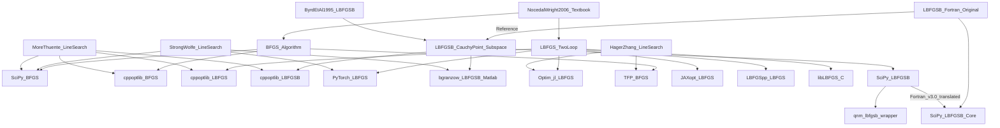

# Implementation Comparison (BFGS / L-BFGS)

This document compares widely-used representative implementations including **BFGS/L-BFGS + L-BFGS-B** to solidify `qnm`'s design decisions (especially **line search** and **safeguards**).

- Targets: `qnm.lbfgsb` (SciPy wrapper), SciPy (BFGS / L-BFGS-B), PyTorch (LBFGS), libLBFGS (C), LBFGSpp (C++), Optim.jl (Julia), JAXopt (JAX), TensorFlow Probability (BFGS), bgranzow/L-BFGS-B (alternative implementation), CppNumericalSolvers (BFGS / L-BFGS / L-BFGS-B)
- Note: Since "default values" and "public APIs" differ by implementation, this focuses on **default behavior + major design points**.

## Comparison Table (Perspectives for Design Decisions)

| Implementation | Primary Target | Line Search | Curvature Check/Damping | Initial Scaling | Stopping Conditions (Representative) |
|---|---|---|---|---|---|
| **`qnm.lbfgsb`** (This Repository) Source: `src/python/qnm/lbfgsb.py` | **Bound constraints** / Large scale (wrapper) | Delegates to SciPy `fmin_l_bfgs_b` | Delegates to SciPy (L-BFGS-B implementation) | Delegates to SciPy (L-BFGS-B implementation) | `pgtol` etc. delegated to SciPy side (`qnm` side handles result formatting + counter consistency) |
| **SciPy BFGS** (Python) Source: [scipy/scipy `scipy/optimize/_optimize.py`](https://github.com/scipy/scipy/blob/main/scipy/optimize/_optimize.py) | Unconstrained / Small-medium scale (dense matrices) | **Strong Wolfe** via `_line_search_wolfe12` (`c1,c2`) | Primarily guarantees positive definiteness via Wolfe. Has safeguard branches for cases like `y^T s == 0` | **Identity matrix** if `hess_inv0` not provided | Gradient norm `gtol`, `xrtol` (small steps), `maxiter`, numerical instability (`nan` etc.) |
| **SciPy L-BFGS-B** (Python/C/Fortran-derived) Source: [scipy/scipy `scipy/optimize/_lbfgsb_py.py`](https://github.com/scipy/scipy/blob/main/scipy/optimize/_lbfgsb_py.py) | **Bound constraints** / Large scale | `maxls` (line search step limit) exposed in API (internally delegates to L-BFGS-B implementation) | Convergence check using **projected gradient** (`pgtol`). Internals depend on implementation (L-BFGS-B v3.0) | Depends on L-BFGS-B implementation | `pgtol` (max component of projected gradient), `factr`/`ftol` (relative decrease), `maxiter`/`maxfun` |
| **PyTorch LBFGS** (Python, DL-oriented) Source: [pytorch/pytorch `torch/optim/lbfgs.py`](https://github.com/pytorch/pytorch/blob/master/torch/optim/lbfgs.py) | Unconstrained / DL (closure-based) | **Strong Wolfe** (cubic interpolate + zoom) when `line_search_fn='strong_wolfe'` | Skips history update when curvature `y^T s` is small (`ys > 1e-10` condition) | **Scalar initialization** via `H_diag = (y^T s)/(y^T y)` (updated each iteration) | `tolerance_grad` (max-norm), `tolerance_change` (update amount/loss difference etc.), `max_iter`, `max_eval` |
| **libLBFGS** (C) Source: [chokkan/liblbfgs `lib/lbfgs.c`](https://github.com/chokkan/liblbfgs/blob/master/lib/lbfgs.c) | Unconstrained / Large scale (low-level API) | Selectable **More-Thuente** or **Backtracking** (Armijo/Wolfe/Strong Wolfe) | Behavior selectable by `linesearch` type. Also has special cases for **OWL-QN (L1)** | Depends on implementation (internal scaling etc.) | `epsilon` (gradient norm type), `past`+`delta` (objective function decrease rate), `max_linesearch`, `max_step/min_step` |
| **LBFGSpp** (C++/Eigen) Source: [yixuan/LBFGSpp `include/LBFGS.h`](https://github.com/yixuan/LBFGSpp/blob/master/include/LBFGS.h) | Unconstrained / Large scale | **LineSearch replaceable via template** (NocedalWright / MoreThuente / Backtracking etc.) | Does not add correction when `s^T y` is weak (`s·y > eps * ||y||^2`) | Default uses **Strong Wolfe** type (`ftol=1e-4`, `wolfe=0.9`). Initial step from implementation | `epsilon`/`epsilon_rel` (gradient norm), `past`+`delta` (objective function), `max_iterations`, `max_linesearch` |
| **Optim.jl LBFGS** (Julia) Source: [JuliaNLSolvers/Optim.jl `l_bfgs.jl`](https://github.com/JuliaNLSolvers/Optim.jl/blob/master/src/multivariate/solvers/first_order/l_bfgs.jl) | Unconstrained / Large scale | Default is **Hager-Zhang** (`LineSearches.HagerZhang()`). Replaceable | Optionally applies **Eq. (7.20)** scaling within two-loop (`scaleinvH0`) | **Eq. 7.20** scaling when `scaleinvH0=true` | Controlled via Optim's `Options` (iteration limit, `g_abstol`/`x_abstol`/`f_reltol` etc.) |
| **JAXopt LBFGS** (JAX) Source: [google/jaxopt `_src/lbfgs.py`](https://github.com/google/jaxopt/blob/main/jaxopt/_src/lbfgs.py) | Unconstrained / Large scale (pytree) | Select `linesearch` (`zoom` / `backtracking` / `hager-zhang`) | Computes `rho = 1/(s^T y)` and sets `rho=0` when `s^T y == 0` etc. (implementation-side safeguards) | Uses **Eq. 7.20** `gamma * I` when `use_gamma` (`compute_gamma`) | `tol` (error), `maxiter`, `stop_if_linesearch_fails` etc. |
| **TFP BFGS** (TensorFlow Probability) Source: [tensorflow/probability `python/optimizer/bfgs.py`](https://github.com/tensorflow/probability/blob/main/tensorflow_probability/python/optimizer/bfgs.py) | Unconstrained / Batch-capable | **Hager-Zhang** (explicitly stated at module start) | Maintains inverse Hessian estimate, room for stabilization via `scale_initial_inverse_hessian` etc. | `scale_initial_inverse_hessian` (scaling of initial inverse Hessian) | `tolerance` (gradient sup norm), `x_tolerance`, `f_relative_tolerance`, `f_absolute_tolerance`, `max_iterations`, `max_line_search_iterations` |
| **bgranzow/L-BFGS-B** (Matlab) Source: [bgranzow/L-BFGS-B `LBFGSB.m`](https://raw.githubusercontent.com/bgranzow/L-BFGS-B/master/LBFGSB.m) | **Bound constraints** / Large scale | Built-in `strong_wolfe()` (**Strong Wolfe**. `c1=1e-4`,`c2=0.9`). Line search executed only when `subspace_min()` is effective | Computes `curv = s^T y` and **warns and skips update** when `curv < eps` (negative curvature detection) | Updates `theta = (y^T y)/(y^T s)` and constructs `W=[Y, theta*S]` (L-BFGS-B internal representation) | **Projected gradient ∞ norm** via `get_optimality()` below `tol`, or `max_iters` reached |
| **cppoptlib BFGS** (C++ / CppNumericalSolvers) Source: [PatWie/CppNumericalSolvers `bfgs.h`](https://raw.githubusercontent.com/PatWie/CppNumericalSolvers/main/include/cppoptlib/solver/bfgs.h) | Unconstrained / Small-medium scale (dense matrices) | **More-Thuente** line search (`more_thuente.h`) | Resets **H to identity matrix** and falls back to `p=-g` when `g^T p > 0` or `nan` | Initial `H=I` | **Default**: `max_iter=10000`, `x_delta=||Δx||_∞ < 1e-9` **5 consecutive times**, `f_delta=|Δf| < 1e-9` **5 consecutive times**, `||g||_∞ < 1e-6` (Source: [`progress.h`](https://raw.githubusercontent.com/PatWie/CppNumericalSolvers/main/include/cppoptlib/solver/progress.h)) |
| **cppoptlib L-BFGS** (C++ / CppNumericalSolvers) Source: [PatWie/CppNumericalSolvers `lbfgs.h`](https://raw.githubusercontent.com/PatWie/CppNumericalSolvers/main/include/cppoptlib/solver/lbfgs.h) | Unconstrained / Large scale | **More-Thuente** line search (`more_thuente.h`) | Falls back to `p=-g` and **resets history** when descent direction is invalid. Also rejects weak curvature updates via cautious update (`cautious_factor_`) | Adaptively updates `scaling_factor_` (roughly $(s^T y)/(y^T y)$ type) | **Default**: `max_iter=10000`, `x_delta=||Δx||_∞ < 1e-9` **5 consecutive times**, `f_delta=|Δf| < 1e-9` **5 consecutive times**, `||g||_∞ < 1e-6` (Source: [`progress.h`](https://raw.githubusercontent.com/PatWie/CppNumericalSolvers/main/include/cppoptlib/solver/progress.h)) |
| **cppoptlib L-BFGS-B** (C++ / CppNumericalSolvers) Source: [PatWie/CppNumericalSolvers `lbfgsb.h`](https://raw.githubusercontent.com/PatWie/CppNumericalSolvers/main/include/cppoptlib/solver/lbfgsb.h) | **Bound constraints** / Large scale | **More-Thuente** line search (`more_thuente.h`) | Update acceptance via `test = |s^T y|` (history update only when `test > 1e-7 * ||y||^2`) | Updates `theta_`, constructs `W`/`M` (L-BFGS-B internal representation) | **Default**: `max_iter=10000`, `x_delta=||Δx||_∞ < 1e-9` **5 consecutive times**, `f_delta=|Δf| < 1e-9` **5 consecutive times**, `||g||_∞ < 1e-6` (Source: [`progress.h`](https://raw.githubusercontent.com/PatWie/CppNumericalSolvers/main/include/cppoptlib/solver/progress.h)) |

## Key Takeaways Directly Related to `qnm` Design Decisions

- **Line search is the largest source of implementation differences**: Even for the same BFGS/L-BFGS, differences between Strong Wolfe / More-Thuente / Hager-Zhang / Backtracking significantly affect convergence and robustness. `qnm` adopts "Strong Wolfe" because it balances theoretical properties (curvature condition) with implementation simplicity.
- **Safeguards converge on "what to do when curvature is weak"**: Many implementations update history only when `s^T y` is sufficiently large, or include safeguard branches. Similarly in `qnm`, explicitly stating update safeguards (reset/skip) improves reproducibility and explainability.
- **Initial scaling (Eq. 7.20) is practically effective**: Adopted (explicitly/implicitly) in many L-BFGS implementations. If adopting in `qnm`, it's good to fix "when to apply it (first time/each time/after reset)" as a specification.

## Genealogy (What is "original" and what is derived)

Important: BFGS/L-BFGS/L-BFGS-B are not "single canonical implementations" but rather three lineages—**(1) textbook algorithms**, **(2) famous line search implementations**, and **(3) original L-BFGS-B Fortran implementation**—that converge and branch into various libraries.

### Genealogy Diagram (Conceptual)

### How to Read This Diagram

- **BFGS/L-BFGS (unconstrained)** tend to have "textbook algorithm + adopted line search (More-Thuente / Strong Wolfe / Hager-Zhang)" as their "effective ancestor."
  - Even for the same BFGS, different line searches significantly change behavior.
- **L-BFGS-B (bound constraints)** has the "original Fortran implementation" as a strong influence source, and SciPy belongs to this lineage.
  - `qnm.lbfgsb` delegates to SciPy, so it hangs from this lineage.
- **Independent implementations** (e.g., bgranzow's Matlab implementation, cppoptlib's L-BFGS-B implementation) are types that "rewrite" using papers/textbooks as primary references, not ports.

(Reference Links)
- The original L-BFGS-B Fortran implementation (distribution source) is a primary reference for many wrappers/ports: [Nocedal's L-BFGS-B Distribution Page](http://users.iems.northwestern.edu/~nocedal/lbfgsb.html)
- Reference: bgranzow's Matlab implementation also explicitly states papers and Fortran implementation as primary references: [bgranzow/L-BFGS-B](https://github.com/bgranzow/L-BFGS-B)
- cppoptlib's L-BFGS-B explicitly implements Cauchy point / subspace minimization / More-Thuente: [`lbfgsb.h`](https://raw.githubusercontent.com/PatWie/CppNumericalSolvers/main/include/cppoptlib/solver/lbfgsb.h)

## Implementer's Guide: Essential Checklist

### 1) Is the direction a "descent direction"?
- Always first check `g^T p < 0` (`p = -H g` should hold, but can break due to numerical issues or safeguard bugs).
- If `g^T p >= 0`, many implementations **fall back to `p = -g` as a safeguard** (especially L-BFGS types).

### 2) Specify "how to handle" curvature condition \(s^T y > 0\)
- Theoretically guaranteed if adopting line search satisfying strong Wolfe, but in practice failures and rounding errors occur.
- Common practical approaches:
  - **Skip history update** (PyTorch / bgranzow)
  - **Reset (clear history or return to \(H=I\))** (design adopted in many implementations)
  - **Add damping** (Powell damping etc.) (more advanced but increases explanation cost)

### 3) When to apply initial scaling (\(\gamma I\) / Eq. 7.20)?
- Many implementations use `gamma = (s^T y)/(y^T y)` (JAXopt, PyTorch, Optim.jl etc.).
- Important to fix "**update every time**" or "**what to do immediately after history reset**".

### 4) Don't make stopping condition "gradient only" (at least 2 types)
- **Gradient norm** (recommended: ∞ norm or max-norm)
- Combining with **small steps** (`||Δx||`) or **small objective function improvement** (`|Δf|`) is stable in practice (SciPy/TFP/LBFGSpp/Optim.jl etc.).

### 5) Essential Points for L-BFGS-B (Bound Constraints)
- Stopping condition uses **projected gradient (projected gradient) ∞ norm**, not ordinary `||g||` (SciPy / bgranzow).
- Direction computation involves "free variable subspace" and "Cauchy point" etc., so simple ports of unconstrained L-BFGS tend to fail.
