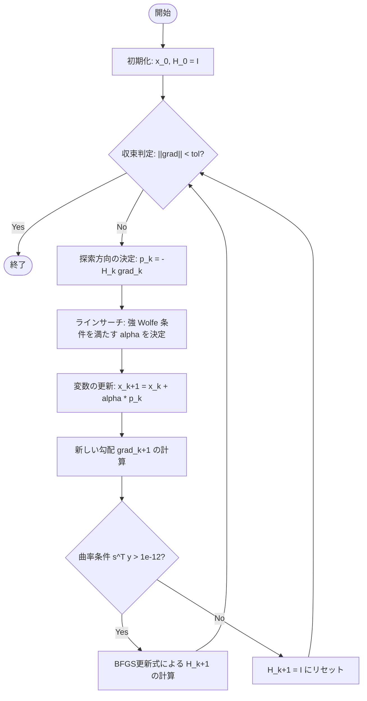

# BFGS (Broyden-Fletcher-Goldfarb-Shanno)

BFGS 法は、準ニュートン法（Quasi-Newton methods）の中で最も広く使われているアルゴリズムの一つです。ニュートン法がヘッセ行列 $\nabla^2 f(x)$ を直接計算し、その逆行列を求めるのに対し、BFGS 法は勾配情報を用いてヘッセ行列の逆行列の近似 $H_k$ を効率的に更新します。

## 1. 基本原理

ニュートン法における更新ステップは $p_k = -(\nabla^2 f(x_k))^{-1} \nabla f(x_k)$ ですが、BFGS ではこれを $p_k = -H_k \nabla f(x_k)$ と近似します。

### セカント条件 (Secant Equation)
新しい近似行列 $H_{k+1}$ は、直近の勾配の変化を正しく反映するために次の**セカント条件**を満たす必要があります。

$$H_{k+1} y_k = s_k$$

ここで、
- $s_k = x_{k+1} - x_k$ （変位）
- $y_k = \nabla f_{k+1} - \nabla f_k$ （勾配の変化）

### 更新式
Nocedal & Wright (2006) の Eq. 6.17 に基づく、逆ヘッセ行列近似 $H$ の更新式は以下の通りです。

$$H_{k+1} = (I - \rho_k s_k y_k^T) H_k (I - \rho_k y_k s_k^T) + \rho_k s_k s_k^T$$

ただし、$\rho_k = \frac{1}{y_k^T s_k}$ です。この式により、$H_k$ が正定値（Positive Definite）であれば、更新後の $H_{k+1}$ も正定値性が維持されます。

## 2. 曲率条件 (Curvature Condition)

$H_{k+1}$ が正定値であるためには、分母の $\rho_k$ が定義可能であること、すなわち以下の**曲率条件**を満たす必要があります。

$$s_k^T y_k > 0$$

実用上、この条件はラインサーチにおいて**強 Wolfe 条件（Strong Wolfe conditions）**を課すことで保証されます。

## 3. アルゴリズムの流れ

`qnm.bfgs` で実装されている手順は以下の通りです。

## 4. 実装のポイント (`qnm.bfgs`)

- **正定値性の維持**: 曲率が失われた場合（$s_k^T y_k \le 10^{-12}$）、数値的安定性のために近似行列を単位行列にリセットします。これは SciPy や CppNumericalSolvers 等の主要な実装でも採用されている一般的な安全策です。
- **計算効率**: 更新式は外積（`np.outer`）と行列積で構成されており、行列の逆計算（$O(n^3)$）を避け、$O(n^2)$ の計算量で更新が可能です。
- **初期近似**: 初期値 $H_0$ は単位行列 $I$ とします。SciPy BFGS 等と同様の設計です。

## 5. インタラクティブ・デモ

ブラウザ上で実際の実装（`qnm.bfgs`）を実行し、近似逆ヘッセ行列 $H$ が更新される様子を確認できます。

<ClientOnly>
  <OptimizerVisualizer algorithm="bfgs" problemType="rosenbrock" :dim="2" />
</ClientOnly>

## 6. 参考文献
- Nocedal, J., & Wright, S. J. (2006). *Numerical Optimization*. Springer. (Chapter 6)
