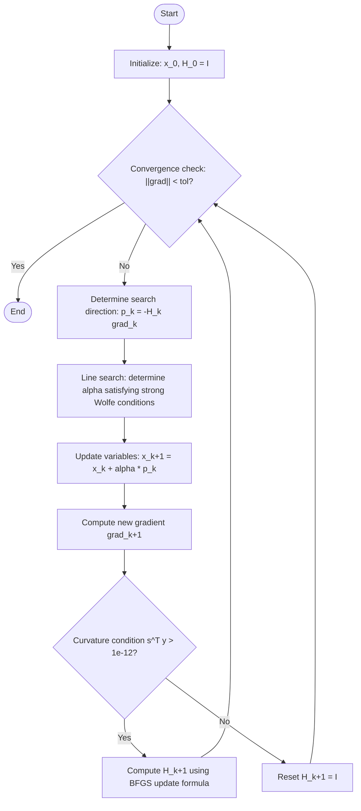

# BFGS (Broyden-Fletcher-Goldfarb-Shanno)

BFGS is one of the most widely used algorithms among quasi-Newton methods. While Newton's method directly computes the Hessian matrix $\nabla^2 f(x)$ and finds its inverse, BFGS efficiently updates an approximation $H_k$ of the inverse Hessian matrix using gradient information.

## Reader Guide

### After reading this page, you should be able to

- Explain the role of the inverse-Hessian approximation $H_k$ and how it generates a search direction $p_k = -H_k g_k$.
- Define $s_k$, $y_k$, and the **secant condition** $H_{k+1}y_k=s_k$.
- State the **curvature condition** $s_k^\top y_k > 0$ and why it matters (positive definiteness, descent directions).
- Recognize the “must-check invariants” when implementing/debugging BFGS.

### Prerequisites

If any of these feel fuzzy, skim **[`concepts.md`](concepts.md)** first:

- Gradient and descent direction ($p^\top g < 0$)
- Strong Wolfe line search (why it’s used)
- Positive definiteness (what it means for stability)

## 1. Basic Principles

The update step in Newton's method is $p_k = -(\nabla^2 f(x_k))^{-1} \nabla f(x_k)$, but BFGS approximates this as $p_k = -H_k \nabla f(x_k)$.

### Secant Equation

The new approximate matrix $H_{k+1}$ must satisfy the following **secant condition** to correctly reflect recent gradient changes.

$$H_{k+1} y_k = s_k$$

where,
- $s_k = x_{k+1} - x_k$ (displacement)
- $y_k = \nabla f_{k+1} - \nabla f_k$ (gradient change)

### Update Formula

Based on Eq. 6.17 of Nocedal & Wright (2006), the update formula for the inverse Hessian approximation $H$ is as follows.

$$H_{k+1} = (I - \rho_k s_k y_k^T) H_k (I - \rho_k y_k s_k^T) + \rho_k s_k s_k^T$$

where $\rho_k = \frac{1}{y_k^T s_k}$. This formula ensures that if $H_k$ is positive definite, the updated $H_{k+1}$ also maintains positive definiteness.

## 2. Curvature Condition

For $H_{k+1}$ to be positive definite, the denominator $\rho_k$ must be well-defined, i.e., the following **curvature condition** must be satisfied.

$$s_k^T y_k > 0$$

In practice, this condition is guaranteed by imposing **strong Wolfe conditions** in line search.

## 2.1 Practical Debug Checklist (BFGS Invariants)

When BFGS “blows up” or stalls, these checks usually pinpoint the issue quickly:

- **Descent direction**: confirm $p_k^\top g_k < 0$ after computing $p_k=-H_k g_k$.
- **Curvature**: confirm $s_k^\top y_k > 0$ before applying the update.
- **Step length sanity**: repeated tiny $\alpha_k$ often indicates scaling issues, noisy gradients, or an incorrect line search.
- **Symmetry drift**: $H_k$ should remain (numerically) symmetric; if your implementation forms it explicitly, enforce symmetry if needed.

## 2.2 Common Failure Modes (and Typical Fixes)

 - **Curvature condition violated** ($s^\top y \le 0$):
  - Typical causes: poor line search, noisy gradients (e.g., numerical differentiation), non-smooth objectives.
  - Typical fixes: enforce strong Wolfe, skip the update, damp the update, or reset $H$ (this project uses a reset safeguard).
- **Not a descent direction** ($p^\top g \ge 0$):
  - Typical causes: loss of positive definiteness, bad scaling, numerical overflow/underflow.
  - Typical fixes: reset $H$, apply damping, or fall back to steepest descent for that iteration.

## 3. Algorithm Flow

The procedure implemented in `qnm.bfgs` is as follows.

## 4. Implementation Points (`qnm.bfgs`)

- **Maintaining Positive Definiteness**: When curvature is lost ($s_k^T y_k \le 10^{-12}$), the approximate matrix is reset to the identity matrix for numerical stability. This is a common safeguard adopted in major implementations such as SciPy and CppNumericalSolvers.
- **Computational Efficiency**: The update formula consists of outer products (`np.outer`) and matrix products, avoiding matrix inversion ($O(n^3)$) and enabling updates in $O(n^2)$ complexity.
- **Initial Approximation**: The initial value $H_0$ is set to the identity matrix $I$, consistent with designs like SciPy BFGS.

## 4.1 Self-check Questions (Quick)

Try answering these without looking back:

1. Why do we enforce (or at least monitor) $s_k^\top y_k > 0$?
2. If $H_k$ is positive definite, why is $p_k=-H_k g_k$ a descent direction?
3. What role does strong Wolfe line search play in making BFGS stable in practice?
4. What is the simplest safe behavior when curvature is lost?

## FAQ

### Q: What does BFGS “update” each iteration?

A: The inverse-Hessian approximation $H_k$. Each iteration computes a direction $p_k = -H_k g_k$, chooses a step length $\alpha_k$ via line search, and then updates $H_k$ using the new $(s_k, y_k)$ pair (see “Algorithm Flow”).

### Q: What is the secant condition $H_{k+1}y_k = s_k$ for?

A: It is the minimal consistency requirement that makes the update reflect the most recent observed change in gradients $y_k$ over the step $s_k$. Satisfying it is what allows $H_{k+1}$ to encode “recent curvature” information (see “Secant Equation”).

### Q: What goes wrong if $s_k^\top y_k > 0$ is violated?

A: $\rho_k = 1/(y_k^\top s_k)$ becomes ill-defined/unstable, positive definiteness can be lost, and the search direction may stop being a descent direction (leading to stalling or instability) (see “Curvature Condition”).

### Q: What is a safe implementation response when curvature is lost?

A: The simplest safe behavior is to **skip the update or reset** the approximation. In this project, when $s^\top y$ is too small, $H$ is reset to $I$ to prioritize numerical stability (see “Implementation Points”).

## 5. Interactive Demo

You can run the actual implementation (`qnm.bfgs`) in your browser and observe how the approximate inverse Hessian matrix $H$ is updated.

<ClientOnly>
  <OptimizerVisualizer algorithm="bfgs" problemType="rosenbrock" :dim="2" />
</ClientOnly>

## 6. References
- Nocedal, J., & Wright, S. J. (2006). *Numerical Optimization*. Springer. (Chapter 6)
