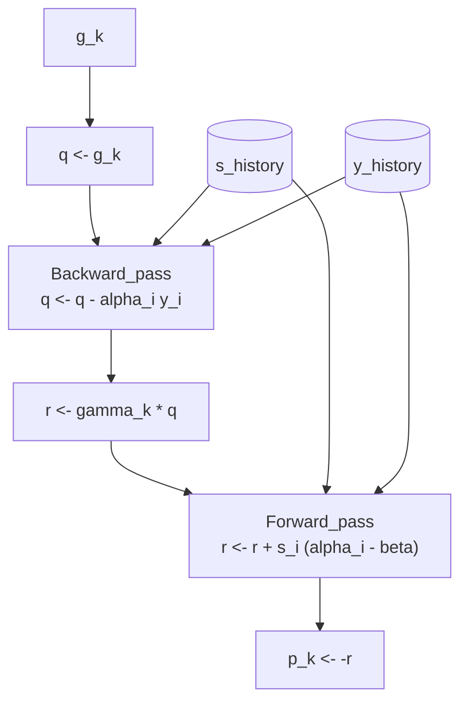

# L-BFGS (Limited-memory BFGS) 解説

L-BFGS は、準ニュートン法の標準である BFGS 法を **大規模な無制約最適化問題**（変数が数千〜数百万）に適用できるよう改良したアルゴリズムです。

BFGS が $n \times n$ の巨大な逆ヘッセ近似行列 $H_k$ を保持・更新するのに対し、L-BFGS は直近 $m$ 回の履歴情報のみを利用し、行列を生成することなく探索方向 $p_k$ を計算します。これにより、メモリ使用量と計算量を劇的に削減します。

## 1. 背景：なぜ "Limited-memory" なのか

変数次元 $n$ が大きい場合、BFGS のボトルネックは「メモリ」と「行列演算」の両方にあります。

* **メモリ**: $n = 10000$ の場合、$H_k$ を保持するだけで $10^8$ 要素（約 800MB）を消費します。$n = 100000$ なら 80GB になり、現実的ではありません。
* **計算**: $H_k$ 行列とベクトルの積は $O(n^2)$ の計算量を要します。

L-BFGS は、逆ヘッセ行列 $H_k$ を**陽に（Explicitly）構成しません**。代わりに、過去 $m$ ステップ分の「変化の履歴」だけを保存し、必要なときに「あたかも $H_k$ があるかのように」演算を行います。

### BFGS vs L-BFGS 比較表

| 項目 | BFGS (Full-memory) | L-BFGS (Limited-memory) |
| --- | --- | --- |
| **保持する情報** | $H_k$ 行列 ($n \times n$) | 直近 $m$ 個のベクトルペア $(s_i, y_i)$ |
| **メモリ使用量** | $O(n^2)$ | $O(mn)$ （$m \ll n$、典型的には $m=5 \sim 20$） |
| **1反復の計算量** | $O(n^2)$ | $O(mn)$ |
| **行列演算** | 必須（行列ベクトル積・外積） | **なし**（ベクトル内積・和のみ） |
| **探索方向の計算** | $p_k = -H_k g_k$ | **Two-loop recursion** アルゴリズム |
| **過去情報の扱い** | 全履歴を $H_k$ に不可逆圧縮 | 直近 $m$ 個を生データで保持（古いものは破棄） |
| **適用規模** | 小〜中規模（$n \lesssim 1000$） | 大規模（$n \gtrsim 10000$） |

---

### 1.1 メモリ削減の核心：行列を作らずベクトルで済ませる

**Q: $m$ 個の履歴を使うなら、計算に $O(mn^2)$ かかるのでは？**

**A: いいえ、行列演算を一切行わないため $O(mn)$ で済みます。**
L-BFGS が保持するのは以下のベクトルペアだけです。

* $s_i = x_{i+1} - x_i$ （変数の変位）
* $y_i = g_{i+1} - g_i$ （勾配の変位）

これらは共に $n$ 次元ベクトルです。$m$ 個の履歴ペアを保持しても、メモリ量は $2mn$ 要素分です。
例えば $n = 10000, m = 10$ の場合、BFGS が $10^8$ 要素を要するのに対し、L-BFGS は $2 \times 10^5$ 要素で済みます（**500倍の節約**）。

**Q: なぜ BFGS は $H_k$ を保持する必要があるのか？**

**A: BFGS は「過去すべての情報」を凝縮しているからです。**
BFGS の $H_k$ は、0ステップ目から現在までの全ての曲率情報を $n \times n$ 行列という形式に「圧縮」して保持しています。これは高精度ですが、一度 $H_k$ に混ぜ込むと個別の履歴は取り出せません（不可逆）。

一方、L-BFGS は「**スライディングウィンドウ**」方式です。

1. 直近 $m$ 個の $(s, y)$ ペアだけをリスト（キュー）で持ちます。
2. 新しいペアが入ると、一番古いペアを捨てます。
3. $H_k$ という行列は作らず、このリストを使って「行列とベクトルの積」に相当する計算をその都度行います。

---

## 2. 実装の前提（記号定義）

この解説および `qnm` ライブラリの実装では以下を前提とします。

* **目的関数**: $f(x)$
* **勾配**: $g_k = \nabla f(x_k)$
* **曲率スカラー**: $\rho_i = 1 / (y_i^\top s_i)$
* **初期近似行列**: $H_k^{(0)} = \gamma_k I$ （単位行列のスカラー倍、反復ごとに更新）
* **ラインサーチ**: Strong Wolfe 条件を使用（十分な降下と曲率条件 $y_k^\top s_k > 0$ を保証するため）。

---

## 3. 理論的基盤：なぜ L-BFGS はうまくいくのか

本節では、L-BFGS が正しく動作する数学的根拠を厳密に証明します。L-BFGS は BFGS の更新式を暗黙的に適用するため、まず BFGS 更新式が満たす性質を確認し、それが L-BFGS にも継承されることを示します。

### 3.1 セカント条件の満足

準ニュートン法が Newton 法を近似するためには、逆ヘッセ近似 $H_{k+1}$ が **セカント条件**（secant equation）を満たす必要があります。

> **定義（セカント条件）**
> $$
> H_{k+1} y_k = s_k
> $$
> ここで $s_k = x_{k+1} - x_k$、$y_k = g_{k+1} - g_k$ である。

この条件は、目的関数 $f$ の 2 次 Taylor 展開から自然に導かれます。$f$ が 2 回連続微分可能なとき、
$$
g_{k+1} - g_k \approx \nabla^2 f(x_k)(x_{k+1} - x_k)
$$
すなわち $y_k \approx B_k s_k$（$B_k = \nabla^2 f(x_k)$）です。逆ヘッセ近似 $H_k \approx B_k^{-1}$ に対しては $H_{k+1} y_k = s_k$ が要求されます。

> **定理 3.1（BFGS 更新式はセカント条件を満たす）**
>
> BFGS 更新式
> $$
> H_{k+1} = (I - \rho_k s_k y_k^\top) H_k (I - \rho_k y_k s_k^\top) + \rho_k s_k s_k^\top
> $$
> （ただし $\rho_k = 1/(y_k^\top s_k)$）を満たす $H_{k+1}$ は、セカント条件 $H_{k+1} y_k = s_k$ を満たす。

**証明**

$H_{k+1} y_k$ を計算する。まず補助変数を定義する：
$$
V_k = I - \rho_k y_k s_k^\top
$$

このとき BFGS 更新式は
$$
H_{k+1} = V_k^\top H_k V_k + \rho_k s_k s_k^\top
$$
と書ける（ここで $V_k^\top = I - \rho_k s_k y_k^\top$）。

$V_k y_k$ を計算すると：
$$
V_k y_k = (I - \rho_k y_k s_k^\top) y_k = y_k - \rho_k y_k (s_k^\top y_k) = y_k - \rho_k y_k \cdot \frac{1}{\rho_k} = y_k - y_k = 0
$$

したがって
$$
H_{k+1} y_k = V_k^\top H_k (V_k y_k) + \rho_k s_k (s_k^\top y_k) = V_k^\top H_k \cdot 0 + \rho_k s_k \cdot \frac{1}{\rho_k} = s_k
$$

よって $H_{k+1} y_k = s_k$ が成り立つ。 ∎

**L-BFGS への適用**: L-BFGS は BFGS 更新式を直近 $m$ 回分だけ再帰的に適用した $H_k$ を暗黙的に構成します。各ステップで上記の定理が成り立つため、L-BFGS の暗黙的 $H_k$ もセカント条件を満たします。

### 3.2 正定値性の保存

探索方向 $p_k = -H_k g_k$ が降下方向であるためには、$H_k$ が**正定値**である必要があります（$g_k^\top H_k g_k > 0$ ならば $p_k^\top g_k < 0$）。

> **定理 3.2（BFGS 更新式は正定値性を保存する）**
>
> $H_k$ が正定値であり、曲率条件 $y_k^\top s_k > 0$ が成り立つならば、BFGS 更新式による $H_{k+1}$ も正定値である。

**証明**

任意の非零ベクトル $v \in \mathbb{R}^n$ に対し、$v^\top H_{k+1} v > 0$ を示す。

BFGS 更新式より
$$
v^\top H_{k+1} v = v^\top V_k^\top H_k V_k v + \rho_k (v^\top s_k)^2
$$

ここで $V_k = I - \rho_k y_k s_k^\top$ である。

**Case 1**: $V_k v \neq 0$ のとき

$H_k$ が正定値なので $(V_k v)^\top H_k (V_k v) > 0$。また $\rho_k > 0$（曲率条件より）かつ $(v^\top s_k)^2 \geq 0$ なので
$$
v^\top H_{k+1} v > 0
$$

**Case 2**: $V_k v = 0$ のとき

$V_k v = 0$ は $v = \rho_k (s_k^\top v) y_k$ を意味する。$v \neq 0$ より $s_k^\top v \neq 0$ である（そうでなければ $v = 0$ となり矛盾）。

このとき
$$
v^\top s_k = \rho_k (s_k^\top v)(y_k^\top s_k) = \rho_k (s_k^\top v) \cdot \frac{1}{\rho_k} = s_k^\top v \neq 0
$$

したがって
$$
v^\top H_{k+1} v = 0 + \rho_k (v^\top s_k)^2 = \rho_k (s_k^\top v)^2 > 0
$$

いずれの場合も $v^\top H_{k+1} v > 0$ が成り立ち、$H_{k+1}$ は正定値である。 ∎

**系 3.2.1**: 初期近似 $H_0 = I$（単位行列）は正定値であり、すべてのステップで曲率条件 $y_k^\top s_k > 0$ が満たされるならば、$H_k$ は任意の $k$ で正定値である。

**L-BFGS への適用**: L-BFGS では $H_k^{(0)} = \gamma_k I$（$\gamma_k > 0$）を用いるため、初期近似は正定値です。各 BFGS 更新ステップで曲率条件が満たされれば、暗黙的に構成される $H_k$ も正定値となります。実装では曲率条件が破れた場合に履歴をクリアし、正定値性を回復させます。

---

## 4. Two-loop Recursion：L-BFGS の心臓部

L-BFGS の最大の特徴は、行列 $H_k$ を作らずに、ベクトル $H_k g_k$ を計算するアルゴリズム **Two-loop recursion** です（Nocedal & Wright, Alg. 7.4）。これにより、探索方向 $p_k = -H_k g_k$ を $O(mn)$ で求めます。

### 4.1 アルゴリズムの手順

履歴メモリには直近 $m$ 個のペア $(s_i, y_i)$ が保存されているとします。

```python
# python-like pseudocode
def compute_direction(g_k, history):
    q = g_k.copy()
    alpha = [0] * m
    
    # 1. Backward Pass (新しい履歴 -> 古い履歴)
    # 勾配 q を徐々に変形していく
    for i in reversed(range(m)):  # m-1, m-2, ..., 0
        s, y, rho = history[i]
        alpha[i] = rho * dot(s, q)
        q = q - alpha[i] * y

    # 2. Initial Scaling (H_k^(0) の適用)
    # 最も新しい曲率情報を使ってスケールを合わせる
    # gamma_k = (s_{last}・y_{last}) / (y_{last}・y_{last})
    r = gamma_k * q

    # 3. Forward Pass (古い履歴 -> 新しい履歴)
    # 変形した q を元に探索方向 r を復元していく
    for i in range(m):            # 0, 1, ..., m-1
        s, y, rho = history[i]
        beta = rho * dot(y, r)
        r = r + s * (alpha[i] - beta)

    return -r  # p_k = -H_k g_k
```



### 4.2 理論的根拠：なぜ two-loop recursion は正しいのか

Two-loop recursion が $H_k g_k$ を正しく計算することを証明します。

#### 4.2.1 BFGS 更新式の積形式（Product Form）

BFGS 更新式を $m$ 回遡って適用すると、$H_k$ は以下の積形式で書けます。

> **補題 4.1（BFGS の積形式）**
>
> $V_i = I - \rho_i y_i s_i^\top$ と定義すると、BFGS 更新を $m$ 回適用した逆ヘッセ近似は
> $$
> H_k = W_m^\top H_k^{(0)} W_m + \sum_{j=0}^{m-1} \rho_{k-m+j} \, W_j^\top s_{k-m+j} s_{k-m+j}^\top W_j
> $$
> ここで $W_j = V_{k-m+j} V_{k-m+j+1} \cdots V_{k-1}, \quad W_m = V_{k-m} V_{k-m+1} \cdots V_{k-1}$ （$W_0 = I$ とする）

Two-loop recursion は、この複雑な行列積を $g_k$ に右から順に適用していることと等価です。

* **Backward pass** は $W_m g_k$ （右側の積）を計算する操作に対応します。
* **Forward pass** は $W_m^\top H_k^{(0)} W_m g_k$ と履歴項の加算に対応します。

**証明の詳細**:
数学的帰納法により、補題 4.1 が成り立つことが示せます。また、各演算がベクトル同士の内積と定数倍加算（AXPY）だけで構成されているため、最終的に $r = H_k g_k$ が得られます（詳細は Nocedal & Wright, Chapter 7 参照）。

### 4.3 計算量とメモリの詳細

**メモリ使用量**:
* 履歴保持: $m$ 個の $(s_i, y_i)$ ペア → $2mn$ 要素 = $O(mn)$
* 作業用変数: $q, r$ （各 $n$ 次元）、$\alpha$ 配列（$m$ 個） → $O(n + m)$
* **合計**: $O(mn)$
* **重要**: 行列演算を一切行わないため、行列をメモリに展開しません。

**時間計算量**:
* **Backward pass**: $m$ 回のループで各 $O(n)$ → $O(mn)$
* **Initial scaling**: $O(n)$
* **Forward pass**: $m$ 回のループで各 $O(n)$ → $O(mn)$
* **合計**: $O(mn)$

この「行列を作らずにベクトル積だけで済ませる」技法が、L-BFGS のメモリ・計算量削減の核心です。

---

## 5. スケーリング係数 $\gamma_k$ の重要性

Two-loop の中間で $r = \gamma_k q$ とするスケーリングは、L-BFGS の性能において極めて重要です。代表的に以下の $\gamma_k$ を用います。
$$
\gamma_k = \frac{s_{k-1}^\top y_{k-1}}{y_{k-1}^\top y_{k-1}}
$$

**物理的な意味**:
これは最新のステップにおける「ヘッセ行列の固有値の逆数」の近似値です。Rayleigh 商の変形として、最新の曲率情報を反映しています。
BFGS では $H_k$ が全履歴を持って「正しいスケール」を学習し続けますが、L-BFGS は記憶が短いため、毎回 $H_k^{(0)} = I$ から始めるとスケール（単位系）が合いません。
$\gamma_k$ を導入することで、**初期ステップ幅 $\alpha \approx 1$ が最適に近くなる**ように補正され、ラインサーチの失敗や無駄な反復を防ぎます。

---

## 6. 収束性の理論保証

L-BFGS は計算を省略していますが、数学的には堅牢な収束性が保証されています。

### 6.1 大域的収束性 (Global Convergence)

> **定理 6.1（大域収束）**
>
> 以下の条件を満たすとき、L-BFGS は大域収束する：
> 1. $f$ は下に有界
> 2. $\nabla f$ はリプシッツ連続
> 3. Wolfe 条件を満たすラインサーチを使用
>
> このとき、$\lim_{k \to \infty} \inf \|\nabla f(x_k)\| = 0$ が成り立つ。

**根拠**: Two-loop で生成される方向 $p_k$ が常に降下方向であり、かつ $H_k$ の固有値が（履歴の有限性により）適切に有界に保たれるため、Zoutendijk の条件を満たします。

### 6.2 線形収束 (Linear Convergence)

> **定理 6.2（強凸関数に対する線形収束）**
>
> 強凸関数に対して、Wolfe 条件を満たすラインサーチを用いる L-BFGS は線形収束（R-linear convergence）する。

BFGS の「超一次収束」には劣りますが、$m$ を増やすことで収束率は向上します。実用上、計算コストの低さが反復回数の増加を補って余りあるパフォーマンスを発揮します。

---

## 7. 実装上の安全策（Safeguards）

実際のコード（`qnm.lbfgs`）では、数値的不安定性に対処するために以下のガードを入れています。

1. **履歴の自動破棄**: `collections.deque(maxlen=m)` を使い、メモリ管理を自動化しています。
2. **降下方向の保証**: 計算された $p_k$ が降下方向でない場合（$p_k^\top g_k \ge 0$）、履歴をクリアして最急降下法（$p_k = -g_k$）にリセットします。
3. **異常な曲率の検知**: $y_k^\top s_k$ が極端に小さい（$10^{-12}$ 以下）場合、その履歴ペアは信頼できないため保存せず、履歴をリセットして $H_k$ の正定値性を守ります。


---

## 8. まとめ：いつ L-BFGS を使うべきか

L-BFGS は、**現代の機械学習や大規模最適化における「第一選択肢」**のひとつです。

| 状況 | 推奨 | 理由 |
| --- | --- | --- |
| **変数が少ない** ($n \leq 1000$) | BFGS | 少ない反復回数で超高精度に収束するため。 |
| **変数が多い** ($n \geq 10000$) | **L-BFGS** | BFGS はメモリ・計算時間的に不利、または実行不可能。 |
| **深層学習** | **L-BFGS** / Adam | 全バッチ学習が可能なら L-BFGS は強力。SGD系よりパラメータ調整が楽。 |
| **メモリ制約が厳しい** | **L-BFGS** | メモリ使用量を $O(mn)$ でコントロールできるため。 |

このように、L-BFGS は「限られたリソースで、ヘッセ行列の威力を最大限に借りる」ための非常に賢いアルゴリズムです。

---

## 9. インタラクティブ・デモ

ブラウザ上で実際の実装（`qnm.lbfgs`）を実行し、履歴バッファ（$s_k, y_k$）が更新される様子を確認できます。

<ClientOnly>
  <OptimizerVisualizer algorithm="lbfgs" problemType="rosenbrock" :dim="2" />
</ClientOnly>

## 10. 参考文献

- Nocedal, J., & Wright, S. J. (2006). *Numerical Optimization* (2nd ed.). Springer. (Chapter 7)
- Liu, D. C., & Nocedal, J. (1989). "[On the limited memory BFGS method for large scale optimization](https://link.springer.com/article/10.1007/BF01589116)". *Mathematical Programming*, 45(1-3), 503-528.
- Dennis, J. E., & Moré, J. J. (1977). "Quasi-Newton methods, motivation and theory". *SIAM Review*, 19(1), 46-89.
- Zoutendijk, G. (1970). "Nonlinear programming, computational methods". In *Integer and Nonlinear Programming* (pp. 37-86). North-Holland.
- [Grokipedia: Limited-memory BFGS](https://grokipedia.com/page/Limited-memory_BFGS) - L-BFGS の概要と実装に関する情報
