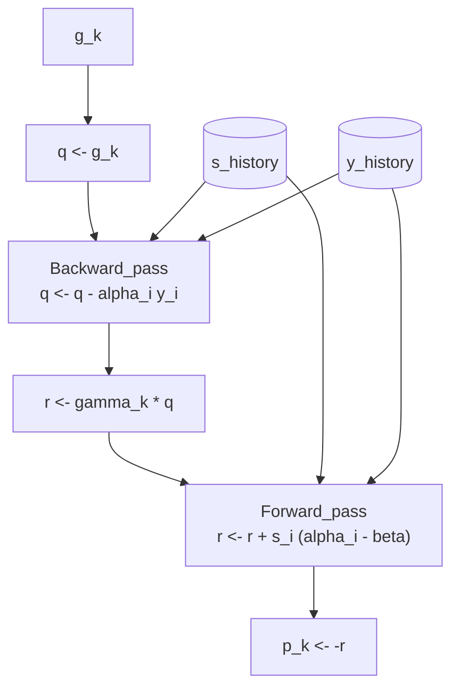
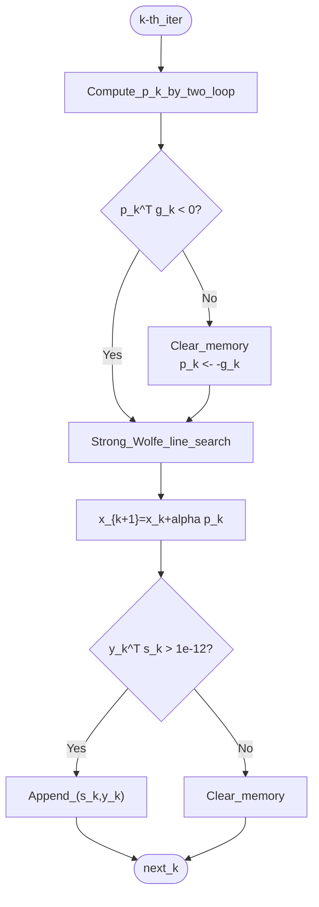

# L-BFGS (Limited-memory BFGS) Explanation

L-BFGS is an algorithm that adapts BFGS, the standard quasi-Newton method, for **large-scale unconstrained optimization problems** (with thousands to millions of variables).

While BFGS maintains and updates a huge $n \times n$ inverse Hessian approximation matrix $H_k$, L-BFGS uses only the most recent $m$ steps of history information and computes the search direction $p_k$ without generating a matrix. This dramatically reduces memory usage and computational cost.

## Reader Guide

### Key takeaway in 60 seconds

L-BFGS behaves like BFGS, but instead of storing \(H_k\) (an \(n\times n\) matrix), it stores only the last \(m\) vector pairs \((s_i, y_i)\) and computes \(p_k=-H_k g_k\) via **two-loop recursion** in \(O(mn)\) time and memory.

### After reading this page, you should be able to

- Explain what “limited-memory” means in concrete memory/time terms (\(O(n^2)\) vs \(O(mn)\)).
- Define the stored history pairs \((s_i, y_i)\) and curvature scalars \(\rho_i\).
- Walk through **two-loop recursion** and describe what each loop is doing conceptually.
- Explain why scaling \(H_k^{(0)}=\gamma_k I\) matters (and how \(\gamma_k\) is chosen).
- List the implementation safeguards used when curvature or descent properties are violated.

### Suggested reading path (skip ahead if you want)

- If you want intuition first: Sections **1–2**, then **4** (two-loop) and **5** (scaling).
- If you want theory/proofs: Section **3**.
- If you want “what can go wrong in code”: Section **7** (safeguards), plus `concepts.md` invariants.

### Prerequisites

Skim **[`bfgs.md`](bfgs.md)** or **[`concepts.md`](concepts.md)** if you need a refresher on:

- Secant condition and curvature condition \(s^\top y>0\)
- Strong Wolfe line search and why it’s used

## 1. Background: Why "Limited-memory"?

When the variable dimension $n$ is large, BFGS faces bottlenecks in both "memory" and "matrix operations."

* **Memory**: For $n = 10000$, storing $H_k$ alone consumes $10^8$ elements (approximately 800MB). For $n = 100000$, this becomes 80GB, which is impractical.
* **Computation**: Matrix-vector products with $H_k$ require $O(n^2)$ computational complexity.

L-BFGS **does not explicitly construct** the inverse Hessian matrix $H_k$. Instead, it stores only the "history of changes" from the past $m$ steps and performs operations "as if $H_k$ exists" when needed.

### BFGS vs L-BFGS Comparison Table

| Aspect | BFGS (Full-memory) | L-BFGS (Limited-memory) |
| --- | --- | --- |
| **Information Stored** | $H_k$ matrix ($n \times n$) | Most recent $m$ vector pairs $(s_i, y_i)$ |
| **Memory Usage** | $O(n^2)$ | $O(mn)$ ($m \ll n$, typically $m=5 \sim 20$) |
| **Computation per Iteration** | $O(n^2)$ | $O(mn)$ |
| **Matrix Operations** | Required (matrix-vector products, outer products) | **None** (only vector inner products and sums) |
| **Search Direction Computation** | $p_k = -H_k g_k$ | **Two-loop recursion** algorithm |
| **Treatment of Past Information** | All history irreversibly compressed into $H_k$ | Most recent $m$ pairs kept as raw data (older ones discarded) |
| **Applicable Scale** | Small to medium ($n \lesssim 1000$) | Large scale ($n \gtrsim 10000$) |

---

### 1.1 Core of Memory Reduction: Using Vectors Instead of Matrices

**Q: If using $m$ history pairs, wouldn't computation take $O(mn^2)$?**

**A: No, it takes only $O(mn)$ because no matrix operations are performed.**
L-BFGS stores only the following vector pairs:

* $s_i = x_{i+1} - x_i$ (variable displacement)
* $y_i = g_{i+1} - g_i$ (gradient displacement)

Both are $n$-dimensional vectors. Even storing $m$ history pairs requires only $2mn$ elements of memory.
For example, with $n = 10000, m = 10$, while BFGS requires $10^8$ elements, L-BFGS needs only $2 \times 10^5$ elements (**500x reduction**).

**Q: Why does BFGS need to store $H_k$?**

**A: Because BFGS compresses "all past information."**
BFGS's $H_k$ "compresses" all curvature information from step 0 to the present into an $n \times n$ matrix format. While this is highly accurate, once mixed into $H_k$, individual history cannot be extracted (irreversible).

In contrast, L-BFGS uses a **"sliding window"** approach.

1. Maintain only the most recent $m$ $(s, y)$ pairs in a list (queue).
2. When a new pair arrives, discard the oldest pair.
3. Do not create an $H_k$ matrix; instead, perform computations equivalent to "matrix-vector products" on demand using this list.

---

## 2. Implementation Assumptions (Notation)

This explanation and the `qnm` library implementation assume the following.

* **Objective function**: $f(x)$
* **Gradient**: $g_k = \nabla f(x_k)$
* **Curvature scalar**: $\rho_i = 1 / (y_i^\top s_i)$
* **Initial approximation matrix**: $H_k^{(0)} = \gamma_k I$ (scalar multiple of identity matrix, updated each iteration)
* **Line search**: Uses strong Wolfe conditions (to guarantee sufficient decrease and curvature condition $y_k^\top s_k > 0$).

---

## 3. Theoretical Foundation: Why L-BFGS Works

This section rigorously proves the mathematical basis for L-BFGS's correct operation. Since L-BFGS implicitly applies BFGS update formulas, we first confirm the properties satisfied by BFGS update formulas and show that they are inherited by L-BFGS.

### 3.1 Satisfaction of Secant Condition

For quasi-Newton methods to approximate Newton's method, the inverse Hessian approximation $H_{k+1}$ must satisfy the **secant condition** (secant equation).

> **Definition (Secant Condition)**
> $$
> H_{k+1} y_k = s_k
> $$
> where $s_k = x_{k+1} - x_k$ and $y_k = g_{k+1} - g_k$.

This condition is naturally derived from the second-order Taylor expansion of the objective function $f$. When $f$ is twice continuously differentiable,
$$
g_{k+1} - g_k \approx \nabla^2 f(x_k)(x_{k+1} - x_k)
$$
i.e., $y_k \approx B_k s_k$ ($B_k = \nabla^2 f(x_k)$). For the inverse Hessian approximation $H_k \approx B_k^{-1}$, $H_{k+1} y_k = s_k$ is required.

> **Theorem 3.1 (BFGS Update Formula Satisfies Secant Condition)**
>
> The $H_{k+1}$ satisfying the BFGS update formula
> $$
> H_{k+1} = (I - \rho_k s_k y_k^\top) H_k (I - \rho_k y_k s_k^\top) + \rho_k s_k s_k^\top
> $$
> (where $\rho_k = 1/(y_k^\top s_k)$) satisfies the secant condition $H_{k+1} y_k = s_k$.

**Proof**

Compute $H_{k+1} y_k$. First, define an auxiliary variable:
$$
V_k = I - \rho_k y_k s_k^\top
$$

Then the BFGS update formula can be written as
$$
H_{k+1} = V_k^\top H_k V_k + \rho_k s_k s_k^\top
$$
(where $V_k^\top = I - \rho_k s_k y_k^\top$).

Computing $V_k y_k$:
$$
V_k y_k = (I - \rho_k y_k s_k^\top) y_k = y_k - \rho_k y_k (s_k^\top y_k) = y_k - \rho_k y_k \cdot \frac{1}{\rho_k} = y_k - y_k = 0
$$

Therefore
$$
H_{k+1} y_k = V_k^\top H_k (V_k y_k) + \rho_k s_k (s_k^\top y_k) = V_k^\top H_k \cdot 0 + \rho_k s_k \cdot \frac{1}{\rho_k} = s_k
$$

Thus $H_{k+1} y_k = s_k$ holds. ∎

**Application to L-BFGS**: L-BFGS implicitly constructs $H_k$ by recursively applying the BFGS update formula only for the most recent $m$ steps. Since the above theorem holds at each step, L-BFGS's implicit $H_k$ also satisfies the secant condition.

### 3.2 Preservation of Positive Definiteness

For the search direction $p_k = -H_k g_k$ to be a descent direction, $H_k$ must be **positive definite** (if $g_k^\top H_k g_k > 0$, then $p_k^\top g_k < 0$).

> **Theorem 3.2 (BFGS Update Formula Preserves Positive Definiteness)**
>
> If $H_k$ is positive definite and the curvature condition $y_k^\top s_k > 0$ holds, then $H_{k+1}$ from the BFGS update formula is also positive definite.

**Proof**

Show that $v^\top H_{k+1} v > 0$ for any nonzero vector $v \in \mathbb{R}^n$.

From the BFGS update formula
$$
v^\top H_{k+1} v = v^\top V_k^\top H_k V_k v + \rho_k (v^\top s_k)^2
$$

where $V_k = I - \rho_k y_k s_k^\top$.

**Case 1**: When $V_k v \neq 0$

Since $H_k$ is positive definite, $(V_k v)^\top H_k (V_k v) > 0$. Also, $\rho_k > 0$ (from curvature condition) and $(v^\top s_k)^2 \geq 0$, so
$$
v^\top H_{k+1} v > 0
$$

**Case 2**: When $V_k v = 0$

$V_k v = 0$ means $v = \rho_k (s_k^\top v) y_k$. Since $v \neq 0$, we have $s_k^\top v \neq 0$ (otherwise $v = 0$, a contradiction).

Then
$$
v^\top s_k = \rho_k (s_k^\top v)(y_k^\top s_k) = \rho_k (s_k^\top v) \cdot \frac{1}{\rho_k} = s_k^\top v \neq 0
$$

Therefore
$$
v^\top H_{k+1} v = 0 + \rho_k (v^\top s_k)^2 = \rho_k (s_k^\top v)^2 > 0
$$

In either case, $v^\top H_{k+1} v > 0$ holds, so $H_{k+1}$ is positive definite. ∎

**Corollary 3.2.1**: The initial approximation $H_0 = I$ (identity matrix) is positive definite, and if the curvature condition $y_k^\top s_k > 0$ is satisfied at all steps, then $H_k$ is positive definite for any $k$.

**Application to L-BFGS**: Since L-BFGS uses $H_k^{(0)} = \gamma_k I$ ($\gamma_k > 0$), the initial approximation is positive definite. If the curvature condition is satisfied at each BFGS update step, the implicitly constructed $H_k$ is also positive definite. In the implementation, when the curvature condition is violated, history is cleared to restore positive definiteness.

---

## 4. Two-loop Recursion: The Heart of L-BFGS

The key feature of L-BFGS is the **Two-loop recursion** algorithm (Nocedal & Wright, Alg. 7.4) that computes the vector $H_k g_k$ without constructing the matrix $H_k$. This enables computing the search direction $p_k = -H_k g_k$ in $O(mn)$.

### 4.1 Algorithm Procedure

Assume the history memory stores the most recent $m$ pairs $(s_i, y_i)$.

```python
# python-like pseudocode
def compute_direction(g_k, history):
    q = g_k.copy()
    alpha = [0] * m
    
    # 1. Backward Pass (newest history -> oldest history)
    # Gradually transform gradient q
    for i in reversed(range(m)):  # m-1, m-2, ..., 0
        s, y, rho = history[i]
        alpha[i] = rho * dot(s, q)
        q = q - alpha[i] * y

    # 2. Initial Scaling (apply H_k^(0))
    # Match scale using the most recent curvature information
    # gamma_k = (s_{last}^T y_{last}) / (y_{last}^T y_{last})
    r = gamma_k * q

    # 3. Forward Pass (oldest history -> newest history)
    # Restore search direction r from transformed q
    for i in range(m):            # 0, 1, ..., m-1
        s, y, rho = history[i]
        beta = rho * dot(y, r)
        r = r + s * (alpha[i] - beta)

    return -r  # p_k = -H_k g_k
```



### 4.2 Theoretical Basis: Why Two-loop Recursion is Correct

We prove that two-loop recursion correctly computes $H_k g_k$.

#### 4.2.1 Product Form of BFGS Update Formula

Applying the BFGS update formula $m$ times backward, $H_k$ can be written in the following product form.

> **Lemma 4.1 (Product Form of BFGS)**
>
> Defining $V_i = I - \rho_i y_i s_i^\top$, the inverse Hessian approximation after applying BFGS updates $m$ times is
> $$
> H_k = W_m^\top H_k^{(0)} W_m + \sum_{j=0}^{m-1} \rho_{k-m+j} \, W_j^\top s_{k-m+j} s_{k-m+j}^\top W_j
> $$
> where $W_j = V_{k-m+j} V_{k-m+j+1} \cdots V_{k-1}, \quad W_m = V_{k-m} V_{k-m+1} \cdots V_{k-1}$ ($W_0 = I$)

Two-loop recursion is equivalent to applying this complex matrix product to $g_k$ from the right sequentially.

* **Backward pass** corresponds to computing $W_m g_k$ (the right-side product).
* **Forward pass** corresponds to $W_m^\top H_k^{(0)} W_m g_k$ and adding history terms.

**Proof Details**:
Mathematical induction shows that Lemma 4.1 holds. Also, since each operation consists only of vector inner products and constant multiple additions (AXPY), we ultimately obtain $r = H_k g_k$ (see Nocedal & Wright, Chapter 7 for details).

### 4.3 Computational Complexity and Memory Details

**Memory Usage**:
* History storage: $m$ pairs of $(s_i, y_i)$ → $2mn$ elements = $O(mn)$
* Working variables: $q, r$ (each $n$-dimensional), $\alpha$ array ($m$ elements) → $O(n + m)$
* **Total**: $O(mn)$
* **Important**: No matrix operations are performed, so matrices are not expanded in memory.

**Time Complexity**:
* **Backward pass**: $m$ iterations, each $O(n)$ → $O(mn)$
* **Initial scaling**: $O(n)$
* **Forward pass**: $m$ iterations, each $O(n)$ → $O(mn)$
* **Total**: $O(mn)$

This technique of "using only vector products without creating matrices" is the core of L-BFGS's memory and computational complexity reduction.

---

## 5. Importance of Scaling Coefficient $\gamma_k$

The scaling $r = \gamma_k q$ in the middle of the two-loop is extremely important for L-BFGS performance. Typically, the following $\gamma_k$ is used:
$$
\gamma_k = \frac{s_{k-1}^\top y_{k-1}}{y_{k-1}^\top y_{k-1}}
$$

**Physical Meaning**:
This is an approximation of the "inverse of Hessian matrix eigenvalues" at the most recent step. As a variant of the Rayleigh quotient, it reflects the most recent curvature information.
While BFGS's $H_k$ continuously learns the "correct scale" by holding all history, L-BFGS has limited memory, so starting from $H_k^{(0)} = I$ each time would mismatch the scale (unit system).
By introducing $\gamma_k$, **the initial step size $\alpha \approx 1$ becomes close to optimal**, preventing line search failures and wasteful iterations.

---

## 6. Theoretical Convergence Guarantees

Although L-BFGS omits computations, it has mathematically robust convergence guarantees.

### 6.1 Global Convergence

> **Theorem 6.1 (Global Convergence)**
>
> L-BFGS converges globally when the following conditions are satisfied:
> 1. $f$ is bounded below
> 2. $\nabla f$ is Lipschitz continuous
> 3. Use line search satisfying Wolfe conditions
>
> Then, $\lim_{k \to \infty} \inf \|\nabla f(x_k)\| = 0$ holds.

**Basis**: The direction $p_k$ generated by the two-loop is always a descent direction, and the eigenvalues of $H_k$ are appropriately bounded (due to finiteness of history), satisfying Zoutendijk's condition.

### 6.2 Linear Convergence

> **Theorem 6.2 (Linear Convergence for Strongly Convex Functions)**
>
> For strongly convex functions, L-BFGS using line search satisfying Wolfe conditions converges linearly (R-linear convergence).

Although inferior to BFGS's "superlinear convergence," increasing $m$ improves the convergence rate. In practice, the low computational cost more than compensates for the increased number of iterations.

---

## 7. Implementation Safeguards

The actual code (`qnm.lbfgs`) includes the following guards to handle numerical instability.

1. **Automatic History Discard**: Uses `collections.deque(maxlen=m)` to automate memory management.
2. **Descent Direction Guarantee**: If the computed $p_k$ is not a descent direction ($p_k^\top g_k \ge 0$), clear history and reset to steepest descent ($p_k = -g_k$).
3. **Abnormal Curvature Detection**: When $y_k^\top s_k$ is extremely small (below $10^{-12}$), that history pair is unreliable, so it is not saved, and history is reset to preserve $H_k$'s positive definiteness.



---

## 8. Summary: When to Use L-BFGS

L-BFGS is one of the **"first choices"** in modern machine learning and large-scale optimization.

| Situation | Recommendation | Reason |
| --- | --- | --- |
| **Few variables** ($n \leq 1000$) | BFGS | Converges to very high accuracy with few iterations. |
| **Many variables** ($n \geq 10000$) | **L-BFGS** | BFGS is disadvantageous or infeasible in memory/computation time. |
| **Deep learning** | **L-BFGS** / Adam | L-BFGS is powerful if full-batch learning is possible. Easier parameter tuning than SGD-based methods. |
| **Strict memory constraints** | **L-BFGS** | Can control memory usage to $O(mn)$. |

Thus, L-BFGS is a very clever algorithm for "maximizing the power of the Hessian matrix with limited resources."

---

## 9. Interactive Demo

You can run the actual implementation (`qnm.lbfgs`) in your browser and observe how the history buffer ($s_k, y_k$) is updated.

<ClientOnly>
  <OptimizerVisualizer algorithm="lbfgs" problemType="rosenbrock" :dim="2" />
</ClientOnly>

## 10. References

- Nocedal, J., & Wright, S. J. (2006). *Numerical Optimization* (2nd ed.). Springer. (Chapter 7)
- Liu, D. C., & Nocedal, J. (1989). "[On the limited memory BFGS method for large scale optimization](https://link.springer.com/article/10.1007/BF01589116)". *Mathematical Programming*, 45(1-3), 503-528.
- Dennis, J. E., & Moré, J. J. (1977). "Quasi-Newton methods, motivation and theory". *SIAM Review*, 19(1), 46-89.
- Zoutendijk, G. (1970). "Nonlinear programming, computational methods". In *Integer and Nonlinear Programming* (pp. 37-86). North-Holland.
- [Grokipedia: Limited-memory BFGS](https://grokipedia.com/page/Limited-memory_BFGS) - Overview and implementation information on L-BFGS
